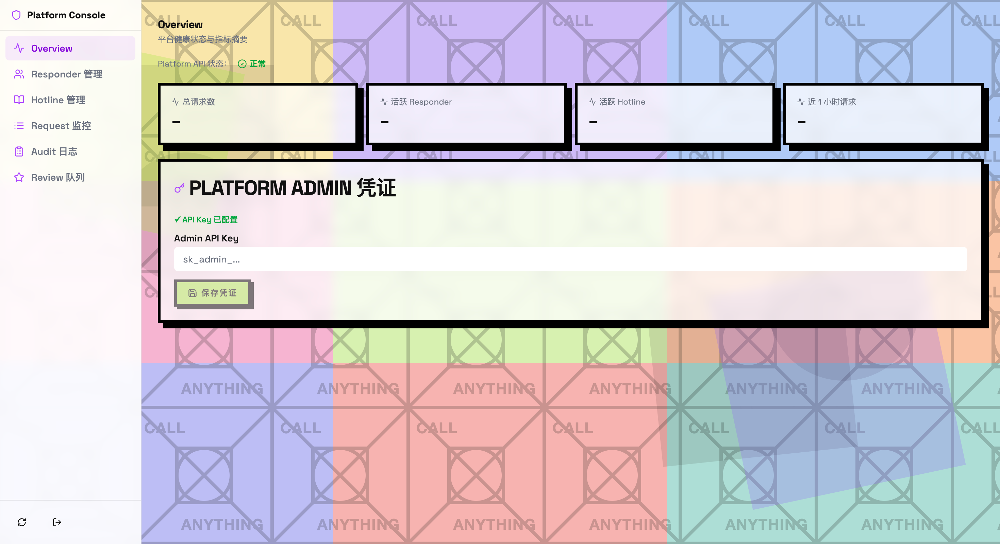

# delegated-execution-platform-selfhost

> **Part of [CALL ANYTHING](https://callanything.xyz/)** — the open protocol that lets any AI agent dial any external capability.
> This repository is the **self-hosted platform & operator console**: deploy with `docker compose` to run your own Hotline catalog, request relay, Responder registry and review queue — for a team, an organization, or a private OPC marketplace.
>
> 📖 [Docs](https://callanything.xyz/docs/) · [Glossary](https://callanything.xyz/glossary/) · [FAQ](https://callanything.xyz/faq/) · [Blog](https://callanything.xyz/blog/) · [Marketplace](https://callanything.xyz/marketplace/) · [Pricing](https://callanything.xyz/pricing/)

> 中文版：[README.zh-CN.md](README.zh-CN.md)

---

## What is CALL ANYTHING?

CALL ANYTHING is an open protocol for **delegated execution** between AI agents and external capability providers. The mental model:

- **Hotline** — one standardized contract that bundles identity, billing, approval, observability and routing into a single dial-able capability. Not an API, not an MCP server, not a SaaS — a Hotline can be **exposed as** any of those, but the product form lives in the protocol.
- **Caller / Responder** — every Hotline call has two ends. A Caller is usually an AI agent or agent team. A Responder is usually a **One-Person Company (OPC)** — an individual turning private expertise into a 7×24 agent-callable, per-call-billable service. See [OPC × Hotline](https://callanything.xyz/blog/2026-04-opc-and-hotline/).
- **This platform** is what an operator runs to host a private or community-scale Hotline marketplace — Hotline catalog, Responder review, request routing, transport relay, an operator console for approvals and observability. The public marketplace at [callanything.xyz/marketplace](https://callanything.xyz/marketplace/) runs the same stack you can self-host here.

You want this repo if you are: a team running an internal agent-tool catalog, an OPC collective bootstrapping a niche marketplace, an enterprise that needs the catalog inside its own VPC, or a researcher reproducing the protocol end-to-end. If you only want to publish or call a single Hotline locally, start with the client repo first.

Companion repositories:

- 📐 **Protocol truth-source** — [delegated-execution-protocol](https://github.com/hejiajiudeeyu/delegated-execution-protocol) (publishes `@delexec/contracts`)
- 🛠️ **End-user CLI & local runtime** — [delegated-execution-client](https://github.com/hejiajiudeeyu/delegated-execution-client) (`@delexec/ops` + `delexec-ops` CLI)
- 🌐 **Public marketplace, docs, brand site** — [callanything.xyz](https://callanything.xyz/)

---

## Quick Deploy

```bash
# Pull the latest compose entrypoint and env template
docker compose -f deploy/public-stack/docker-compose.yml up -d
```

Configure your environment by copying and editing the template:

```bash
cp deploy/platform/.env.example deploy/platform/.env
# Edit .env with your domain, secrets, and SMTP settings
```

---

## Platform Control Console

The **Platform Control** web console is available after deployment at the gateway URL. It gives operators a real-time view of platform health and all registered entities.



The Overview page shows:

- **Platform API** reachability status
- Live metrics: total requests, active Responders, active Hotlines, requests in the last hour
- **Platform Admin credentials** — configure your Admin API Key to enable full operator access

---

## Responder Management

Browse all registered Responders, inspect their status, and approve or suspend access from a single list view.


*Place `docs/screenshots/responders.png` in the screenshots directory to show this section.*

---

## Hotline Review Queue

Review incoming Hotline registration requests before they are published to the catalog. Approve or reject submissions from the Review queue.


*Place `docs/screenshots/reviews.png` in the screenshots directory to show this section.*

---

## Hotline Management

View and manage all Hotlines registered on the platform, including their status, owner, and capability tags.


*Place `docs/screenshots/hotlines-admin.png` in the screenshots directory to show this section.*

---

## Repository Responsibility

This repository owns the operator-facing self-hosted deployment surface:

- platform API, relay, Platform Control gateway, and deployable platform images
- Dockerfiles, `docker compose` entrypoints, and operator environment templates
- image build/smoke workflows and operator deployment documentation
- platform-side persistence and server-side integration wiring

This repository does not own the protocol truth source or the end-user `delexec-ops` client experience.

Current product boundary:

- the `delexec-ops` client currently focuses on local caller / responder / hotline management first
- first-use local registration and self-call do not require this repository
- self-hosted platform deployment and future community / catalog publishing remain the responsibility of this repository

## AI Collaboration

- `CLAUDE.md` defines the repository-specific development and validation rules.
- `AGENTS.md` gives a minimal routing and ownership summary for AI coding agents.

## Public Product Surface

The intended end-user entry for this repository is a Docker-based deployment flow:

- an official `docker compose` entrypoint
- one `.env` template
- one operator deployment guide

The internal npm packages exist to support builds, tests, and image assembly. They are not the primary installation path for operators.

## Shared Dependencies

This repository consumes a small set of published shared packages:

- `@delexec/contracts`
- `@delexec/runtime-utils`
- `@delexec/sqlite-store`

## Release Model

- Primary operator-facing release artifact: Docker images plus `docker compose`
- Internal development artifacts: workspace npm packages such as `@delexec/platform-api`, `@delexec/transport-relay`, and `@delexec/postgres-store`

See also: `docs/current/guides/release-surface.md`

## How To Develop Here

- Start here when the change affects operator deployment, server-side APIs, relay behavior, platform persistence, or image/compose delivery.
- Keep the operator product boundary simple: the primary supported path is Docker images plus `docker compose`, not npm installation of server packages.
- Treat `deploy/public-stack`, `deploy/platform`, and `deploy/relay` as the supported deployment surfaces.

Recommended change flow:

1. If the change alters protocol semantics, update `delegated-execution-protocol` first and consume the released `@delexec/contracts`.
2. Implement platform and deployment changes here.
3. Run platform CI, package checks, deploy config checks, and public-stack smoke.
4. Release Docker images and compose artifacts as the operator-facing deliverable.

When working through the fourth-repo workspace, prefer the top-level `corepack pnpm install` plus `corepack pnpm run sync:local-contracts` flow before cross-repo validation.
